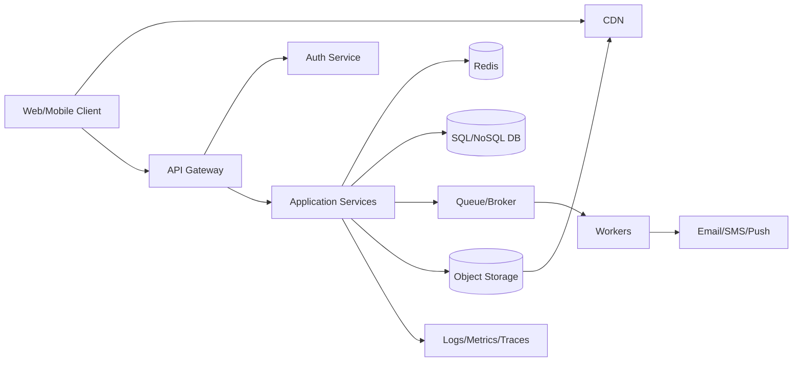

# System Design Overview Diagram

```mermaid
flowchart LR
  Client[Web/Mobile Client] --> CDN[CDN]
  Client --> Gateway[API Gateway]
  Gateway --> Auth[Auth Service]
  Gateway --> App[Application Services]
  App --> Cache[(Redis)]
  App --> DB[(SQL/NoSQL DB)]
  App --> Queue[Queue/Broker]
  Queue --> Workers[Workers]
  Workers --> Email[Email/SMS/Push]
  App --> Object[(Object Storage)]
  Object --> CDN
  App --> Observability[Logs/Metrics/Traces]
```

