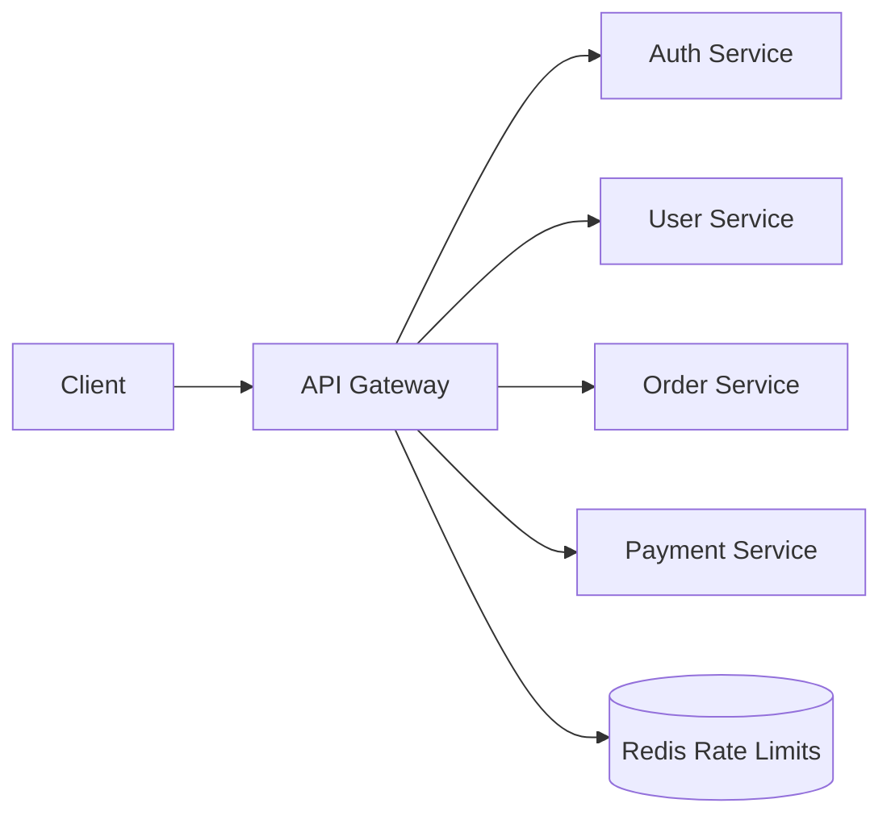

# System Design: API Gateway

## Problem Statement

Design an API gateway that sits between clients and backend services.

## Functional Requirements

- Route requests to services.
- Authenticate requests.
- Apply rate limits.
- Handle request logging and tracing.

## Non-functional Requirements

- High availability.
- Low overhead.
- Configurable routing.
- Strong security.

## HLD



## LLD

- Route matcher.
- Auth filter.
- Rate limit filter.
- Request ID and trace context injector.
- Response transformer where needed.

## API Design

The gateway exposes public routes and maps them to internal services:

```text
/api/orders/* -> order-service
/api/payments/* -> payment-service
```

## Scaling Approach

Run multiple gateway instances behind a load balancer. Keep gateway stateless and store counters in Redis.

## Tradeoffs

Centralized cross-cutting logic is easier to manage, but gateway outages affect all services.

## Bottlenecks

TLS termination, auth checks, rate limit Redis latency, large payloads.

## Security Concerns

Validate tokens, strip dangerous headers, enforce CORS, rate limit, and log suspicious traffic.

## Monitoring Strategy

Track request rate, route latency, auth failures, 4xx/5xx, upstream errors, and rate-limit blocks.

