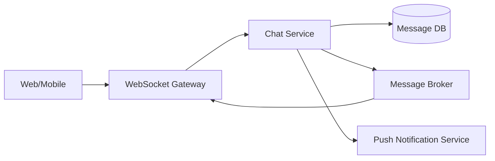

# System Design: Chat Application

## Problem Statement

Design real-time one-to-one and group chat for a product like customer support or team messaging.

## Functional Requirements

- Send and receive messages.
- Support one-to-one and group conversations.
- Show delivery and read status.
- Store message history.

## Non-functional Requirements

- Low latency for online users.
- Durable message storage.
- Reconnect support.
- Horizontal scalability.

## HLD



## LLD

- `Conversation`: participants and type.
- `Message`: id, conversationId, senderId, body, createdAt.
- `DeliveryReceipt`: messageId, userId, deliveredAt, readAt.

## API Design

```http
GET /v1/conversations
GET /v1/conversations/:id/messages?cursor=...
POST /v1/conversations/:id/messages
WS chat.message.send
WS chat.message.delivered
```

## DB Schema

```sql
CREATE TABLE messages (
  id BIGSERIAL PRIMARY KEY,
  conversation_id BIGINT NOT NULL,
  sender_id BIGINT NOT NULL,
  body TEXT NOT NULL,
  created_at TIMESTAMPTZ NOT NULL DEFAULT now()
);

CREATE INDEX idx_messages_conversation_created ON messages (conversation_id, created_at DESC);
```

## Scaling Approach

Partition messages by conversation ID. Use WebSocket gateways plus broker fanout. Store offline notifications in queue.

## Tradeoffs

Strong ordering per conversation is easier than global ordering. Read receipts add write volume.

## Bottlenecks

Large groups, unread counters, hot conversations, slow mobile clients.

## Security Concerns

Authenticate socket, verify conversation membership, encrypt transport, moderate abuse, and avoid leaking message history.

## Monitoring Strategy

Track send latency, delivery latency, connection count, reconnect rate, broker lag, and failed sends.

