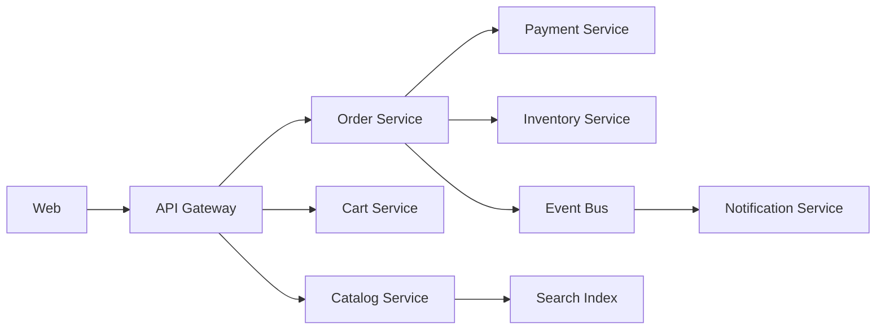

# System Design: E-commerce Architecture

## Problem Statement

Design an e-commerce platform with catalog, cart, checkout, payment, inventory, shipment, and admin operations.

## Functional Requirements

- Browse products.
- Add items to cart.
- Place orders.
- Pay safely.
- Track shipment.
- Admin manages products and orders.

## Non-functional Requirements

- Checkout must be reliable.
- Product pages must load fast.
- Inventory must not oversell.
- Payment must be auditable.

## HLD



## LLD

- Cart can be Redis plus DB persistence.
- Order service owns order lifecycle.
- Payment service owns idempotency and webhook reconciliation.
- Inventory service reserves stock during checkout.

## API Design

```http
GET /v1/products
POST /v1/cart/items
POST /v1/orders
POST /v1/payments/intents
GET /v1/orders/:id
```

## DB Schema

```sql
CREATE TABLE order_items (
  id BIGSERIAL PRIMARY KEY,
  order_id BIGINT NOT NULL,
  product_id BIGINT NOT NULL,
  quantity INTEGER NOT NULL,
  price_in_paise INTEGER NOT NULL
);
```

## Scaling Approach

Use CDN for product images, search index for discovery, cache product reads, queue async emails, and isolate payment workflow.

## Tradeoffs

Strong inventory consistency reduces oversell but may increase checkout latency.

## Bottlenecks

Flash sales, cart hot keys, inventory locks, payment provider latency.

## Security Concerns

Never trust client price, protect payment data, audit admin actions, and prevent coupon abuse.

## Monitoring Strategy

Track checkout conversion, payment success rate, inventory reservation failures, order latency, and provider errors.

