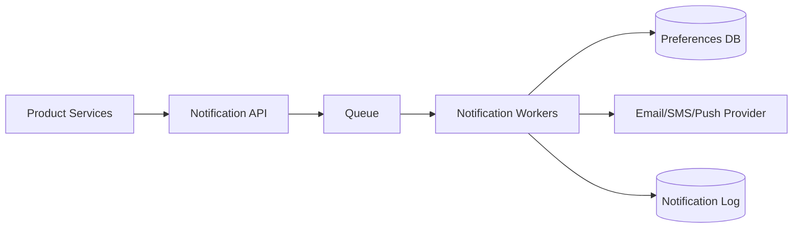

# System Design: Notification Service

## Problem Statement

Design a service that sends email, SMS, push, and in-app notifications for products like LinkedIn, Amazon, or banking apps.

## Functional Requirements

- Send notification through multiple channels.
- Support templates and localization.
- Respect user preferences.
- Retry failed deliveries.

## Non-functional Requirements

- Reliable delivery.
- Idempotent processing.
- Scalable fanout.
- Auditable history.

## HLD



## LLD

- `NotificationRequest`: recipient, template, channel, idempotencyKey.
- `TemplateRenderer`: fills variables.
- `ProviderAdapter`: hides provider differences.
- `RetryPolicy`: exponential backoff with dead-letter queue.

## API Design

```http
POST /v1/notifications
GET /v1/notifications/:id
```

## DB Schema

```sql
CREATE TABLE notification_log (
  id BIGSERIAL PRIMARY KEY,
  idempotency_key TEXT UNIQUE NOT NULL,
  user_id BIGINT NOT NULL,
  channel TEXT NOT NULL,
  status TEXT NOT NULL,
  created_at TIMESTAMPTZ NOT NULL DEFAULT now()
);
```

## Scaling Approach

Use queues per priority and channel. Batch low-priority notifications. Cache templates and preferences.

## Tradeoffs

Immediate sending is simple but less resilient. Queues add delay but improve reliability.

## Bottlenecks

Provider rate limits, queue backlog, template rendering spikes, duplicate events.

## Security Concerns

Do not leak PII in logs. Verify template variables. Respect unsubscribe and consent rules.

## Monitoring Strategy

Track queued, sent, failed, retried, provider latency, dead-letter count, and unsubscribe complaints.

