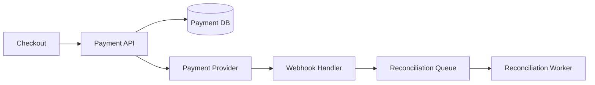

# System Design: Payment Service

## Problem Statement

Design a payment service that supports checkout, retries, refunds, webhooks, and reconciliation.

## Functional Requirements

- Create payment intent.
- Confirm payment.
- Handle provider webhooks.
- Support refunds.
- Store audit trail.

## Non-functional Requirements

- Idempotent operations.
- High reliability.
- Strong auditability.
- Secure handling of sensitive data.

## HLD



## LLD

- Use idempotency keys for create and refund requests.
- Store provider reference ID.
- Webhook handler verifies signatures and updates state.
- Reconciliation job compares local state with provider state.

## API Design

```http
POST /v1/payments
POST /v1/payments/:id/refunds
POST /v1/webhooks/payment-provider
GET /v1/payments/:id
```

## DB Schema

```sql
CREATE TABLE payments (
  id UUID PRIMARY KEY,
  order_id BIGINT NOT NULL,
  idempotency_key TEXT UNIQUE NOT NULL,
  amount_in_paise INTEGER NOT NULL,
  status TEXT NOT NULL,
  provider_reference TEXT,
  created_at TIMESTAMPTZ NOT NULL DEFAULT now()
);
```

## Scaling Approach

Keep payment writes strongly consistent. Process provider callbacks asynchronously after fast signature verification.

## Tradeoffs

Synchronous provider confirmation is simple but slower. Async webhooks are reliable but require state machines.

## Bottlenecks

Provider latency, duplicate webhooks, reconciliation backlog, DB locks.

## Security Concerns

Verify webhook signatures, do not store card data, use PCI-compliant provider, encrypt sensitive metadata, and audit every state change.

## Monitoring Strategy

Track payment success rate, duplicate idempotency hits, webhook failures, refund latency, and reconciliation mismatches.

