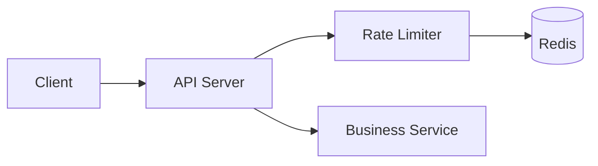

# System Design: Rate Limiter

## Problem Statement

Design a rate limiter to prevent abuse on login, checkout, OTP, search, and public APIs.

## Functional Requirements

- Limit requests by user, IP, API key, or endpoint.
- Return clear retry response.
- Support different limits per route.

## Non-functional Requirements

- Very low latency.
- Accurate enough under concurrency.
- Works across multiple API servers.

## HLD



## LLD

- Token bucket for burst support.
- Fixed window for simple endpoints.
- Sliding window for smoother limits.

## API Design

```http
HTTP/1.1 429 Too Many Requests
Retry-After: 30
```

## Redis Design

```text
rate:login:ip:203.0.113.10 -> count, ttl=60s
rate:checkout:user:42 -> count, ttl=10s
```

## Scaling Approach

Use Redis atomic commands or Lua scripts. Keep limits close to API gateway for early rejection.

## Tradeoffs

Fixed window is simple but allows boundary bursts. Token bucket handles bursts but is more complex.

## Bottlenecks

Redis hot keys, network latency, abusive distributed IPs.

## Security Concerns

Limit login, OTP, password reset, payment, signup, and scraping endpoints. Combine with CAPTCHA or risk scoring when needed.

## Monitoring Strategy

Track allowed, blocked, top keys, Redis latency, and false positives.

