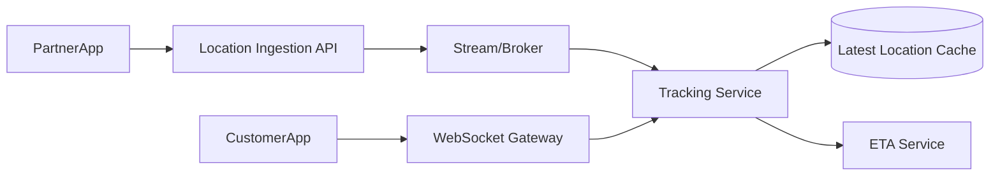

# System Design: Real-time Tracking System

## Problem Statement

Design live delivery tracking like Zomato, Swiggy, or ride-sharing apps.

## Functional Requirements

- Delivery partner sends location updates.
- Customer sees live location.
- ETA updates.
- Support order states.

## Non-functional Requirements

- Low latency.
- Efficient mobile battery/network usage.
- Handles many concurrent deliveries.
- Secure location access.

## HLD



## LLD

- Store latest location in Redis.
- Persist sampled location history for audit.
- Push updates only to authorized order viewers.

## API Design

```http
POST /v1/orders/:id/location
GET /v1/orders/:id/tracking
WS order.location.updated
```

## DB Schema

```sql
CREATE TABLE delivery_locations (
  id BIGSERIAL PRIMARY KEY,
  order_id BIGINT NOT NULL,
  partner_id BIGINT NOT NULL,
  lat DOUBLE PRECISION NOT NULL,
  lng DOUBLE PRECISION NOT NULL,
  recorded_at TIMESTAMPTZ NOT NULL
);
```

## Scaling Approach

Throttle location updates, use streaming ingestion, cache latest location, and fan out through WebSockets.

## Tradeoffs

Frequent updates improve accuracy but increase battery, bandwidth, and server load.

## Bottlenecks

Update spikes, WebSocket fanout, ETA computation, Redis hot keys.

## Security Concerns

Only customer, partner, and support should access tracking. Stop sharing after order completion.

## Monitoring Strategy

Track update latency, stale location count, WebSocket delivery rate, ETA error, and mobile update frequency.

