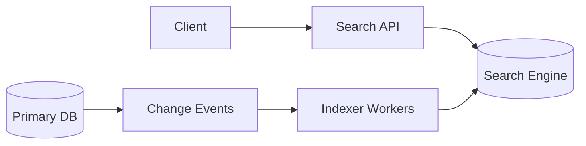

# System Design: Search System

## Problem Statement

Design search for products, posts, or restaurants with filters, ranking, autocomplete, and typo tolerance.

## Functional Requirements

- Full-text search.
- Filters and sorting.
- Autocomplete.
- Ranking by relevance and business signals.

## Non-functional Requirements

- Low search latency.
- Eventually consistent indexing.
- High availability.

## HLD



## LLD

- Primary DB remains source of truth.
- Search index stores denormalized searchable documents.
- Indexer consumes product or post change events.

## API Design

```http
GET /v1/search?q=shoes&brand=nike&sort=relevance
GET /v1/search/suggestions?q=sho
```

## DB Schema

```json
{
  "id": "product_123",
  "title": "Running Shoes",
  "brand": "Nike",
  "category": "sports",
  "price": 499900,
  "rating": 4.5
}
```

## Scaling Approach

Shard search index by document ID or category. Cache popular queries. Use async indexing.

## Tradeoffs

Search results can be slightly stale because indexing is async.

## Bottlenecks

Heavy filters, high-cardinality facets, indexing spikes, popular queries.

## Security Concerns

Filter private documents by permissions. Do not leak deleted or restricted content through stale indexes.

## Monitoring Strategy

Track search latency, no-result rate, indexing lag, query errors, and click-through rate.

