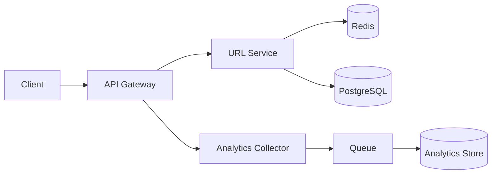

# System Design: URL Shortener

## Problem Statement

Design a service like bit.ly that converts long URLs into short links and redirects users quickly.

## Functional Requirements

- Create short URL for a long URL.
- Redirect short URL to original URL.
- Support custom aliases.
- Track click analytics.

## Non-functional Requirements

- Redirect latency under 50 ms at p95.
- High availability for redirects.
- Short codes must be unique.
- Analytics can be eventually consistent.

## HLD



## LLD

- `UrlService.create(longUrl, userId, alias?)`
- `UrlService.resolve(code)`
- `CodeGenerator.next()` using base62 or ID range allocation.
- `AnalyticsConsumer.recordClick(event)` asynchronously.

## API Design

```http
POST /v1/links
GET /:code
GET /v1/links/:code/analytics
```

## DB Schema

```sql
CREATE TABLE short_links (
  id BIGSERIAL PRIMARY KEY,
  code VARCHAR(16) UNIQUE NOT NULL,
  long_url TEXT NOT NULL,
  user_id BIGINT,
  created_at TIMESTAMPTZ NOT NULL DEFAULT now()
);
```

## Scaling Approach

Cache `code -> long_url` in Redis. Use read replicas for redirects. Write analytics to a queue so redirects stay fast.

## Tradeoffs

Random codes are simple but need collision checks. Sequential IDs are fast but predictable unless encoded or salted.

## Bottlenecks

Hot links, DB lookups on cache miss, analytics write spikes.

## Security Concerns

Detect malicious URLs, rate limit link creation, block private network redirects, and scan abuse reports.

## Monitoring Strategy

Track redirect latency, cache hit ratio, 404 rate, link creation rate, queue lag, and abuse reports.

