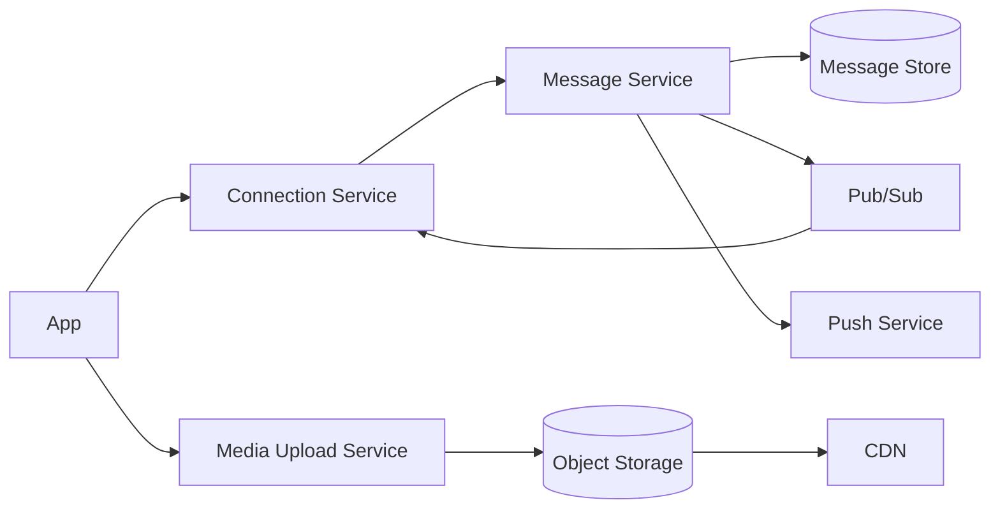

# System Design: WhatsApp Clone

## Problem Statement

Design a WhatsApp-like messaging system with real-time chat, media messages, presence, offline delivery, and end-to-end encryption awareness.

## Functional Requirements

- One-to-one and group messages.
- Media upload and download.
- Online presence and typing indicators.
- Delivery and read receipts.
- Offline push notifications.

## Non-functional Requirements

- Very low latency for online users.
- Durable storage.
- Strong privacy.
- Works under unstable mobile networks.

## HLD



## LLD

- Message IDs generated client-side plus server sequence per conversation.
- Deduplication by `(conversationId, clientMessageId)`.
- Presence stored with TTL in Redis.

## API Design

```http
POST /v1/media/upload-url
GET /v1/chats/:chatId/messages?cursor=...
WS message.send
WS message.ack
WS presence.update
```

## DB Schema

```sql
CREATE TABLE chat_messages (
  id BIGSERIAL PRIMARY KEY,
  chat_id BIGINT NOT NULL,
  sender_id BIGINT NOT NULL,
  client_message_id UUID NOT NULL,
  encrypted_payload BYTEA NOT NULL,
  created_at TIMESTAMPTZ NOT NULL DEFAULT now(),
  UNIQUE (chat_id, client_message_id)
);
```

## Scaling Approach

Use regional WebSocket gateways, pub/sub for fanout, object storage for media, and push notifications for offline users.

## Tradeoffs

End-to-end encryption improves privacy but limits server-side search and moderation.

## Bottlenecks

Large group fanout, media upload bandwidth, presence churn, reconnect storms.

## Security Concerns

Protect encryption keys on clients, verify chat membership, rate limit spam, and secure media URLs.

## Monitoring Strategy

Track connection health, duplicate message rate, ack latency, media upload errors, and push delivery failures.

