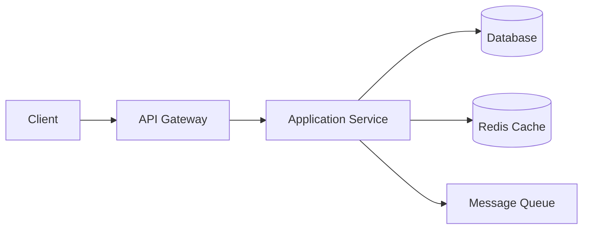

# System Design: Service Name

## Problem Statement

Design the system for a realistic product scenario.

## Functional Requirements

- Requirement 1.
- Requirement 2.

## Non-functional Requirements

- Availability.
- Latency.
- Scalability.
- Durability.
- Security.

## High-level Design



## Low-level Design

Explain services, classes, modules, and responsibilities.

## API Design

```http
POST /v1/resources
GET /v1/resources/:id
```

## Database Schema

```sql
CREATE TABLE resources (
  id BIGSERIAL PRIMARY KEY,
  created_at TIMESTAMPTZ NOT NULL DEFAULT now()
);
```

## Scaling Approach

Explain cache, queues, partitioning, replication, CDN, and async processing.

## Tradeoffs

Explain why one design is chosen over another.

## Bottlenecks

Explain hot keys, slow queries, fanout, network calls, and storage limits.

## Security Concerns

Explain auth, authorization, rate limits, validation, encryption, and audit logs.

## Monitoring Strategy

Track latency, error rate, throughput, saturation, queue depth, cache hit ratio, and business metrics.

